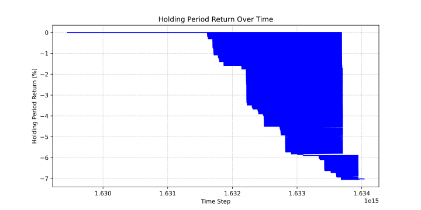
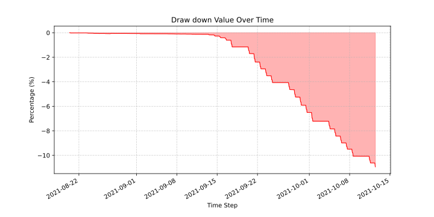
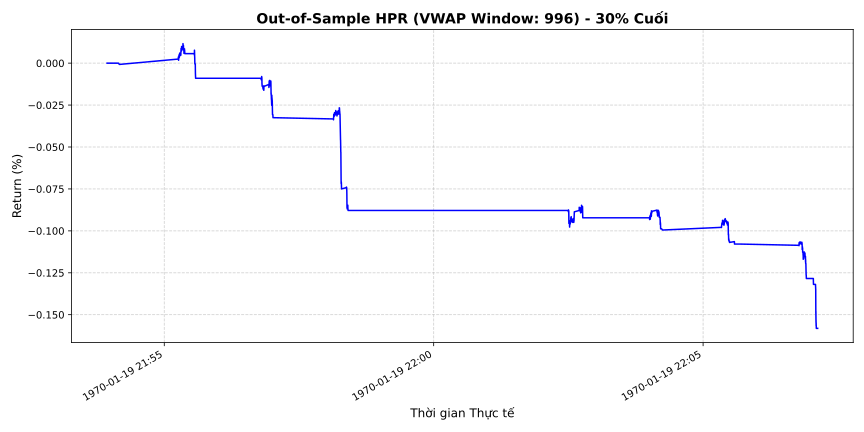
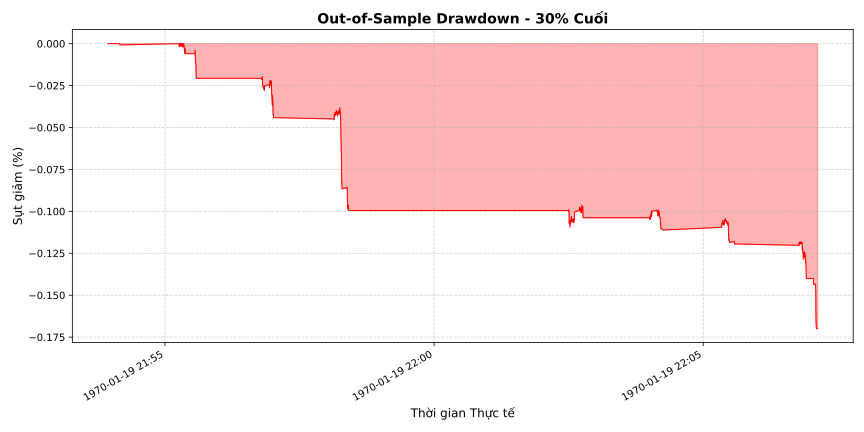

### PROTO:Plutus Core
#### High-Performance VWAP Momentum Engine
A high-frequency algorithmic trading system combining Python flexibility and C++ execution speed.

#### Abstract
In this project, we develop a high-performance algorithmic trading system utilizing a C++ engine to optimize Volume Weighted Average Price (VWAP) calculations and execute a Price Momentum strategy. Tick data is ingested to identify momentum breakouts relative to the VWAP baseline. The system offloads heavy computation and grid-search optimization to a multithreaded C++ shared library, significantly reducing processing time.

#### Introduction
In intraday algorithmic trading, execution speed and rapid parameter optimization are critical. This project bridges Python's analytical capabilities with C++'s raw execution speed. By moving intensive VWAP loop calculations into a C++ engine (`vwap_engine.so`), we create a robust framework capable of rigorous hypothesis testing, fast parameter grid-search, and reliable performance evaluation across different market conditions.

#### Hypothesis
We apply a Price Momentum Strategy using the Volume Weighted Average Price (VWAP) as a dynamic intraday benchmark.
*   **Long condition:** We assume upward momentum is confirmed when the real-time matched price breaks significantly above the VWAP.
*   **Short condition:** We assume downward momentum is confirmed when the price breaks significantly below the VWAP.
*   **Exit condition:** Positions are closed dynamically based on signal-based reversals (e.g., price crossing back the VWAP baseline) or time-based intraday conditions, adapting to market fluctuations without relying on fixed take-profit or stop-loss thresholds.
#### Data
*   **Data source:** Algotrade raw database
*   **Data period:** 22/8/2021 to 22/10/2021
*   **Data format:** CSV files.
*   **Fees:** 0.05%

##### Data collection
*   The raw tick price and volume data (`quote_matched.csv` and `quote_matchedvolume.csv`) are integrated using a Map-Reduce Joiner.
*   The data is collected using the script `import_algotrade_data.py`.
*   The processed data is stored in the `data/is`

#### Implementation
##### Environment Setup
1. Set up python virtual environment
```bash
python -m venv venv
source venv/bin/activate # for Linux/MacOS
.\venv\Scripts\activate.bat # for Windows command line
.\venv\Scripts\Activate.ps1 # for Windows PowerShell
```
2. Install the required packages
```bash
pip install -r requirements.txt
```
3. Build the C++ Engine
```bash
g++ -shared -o cpp_engine/vwap_engine.so -fPIC cpp_engine/vwap_engine.cpp -pthread -O3
```

##### Data Collection
Run the ETL pipeline to map and reduce raw data:
```bash
python import_algotrade_data.py
```

##### In-sample Backtesting
Execute the main flow to evaluate the current strategy configurations:
```bash
python main.py
```
The results are stored in the `result/backtest/` folder.

##### Optimization
To run the optimization using the C++ multithreading engine, execute:
```bash
python optimization.py
```
The optimized parameters will be stored in `parameter/` and visual results in `result/optimization/`.

##### Out-of-sample Backtesting
To run the out-of-sample backtesting, configure your out-of-sample data period and run main.py. The results are stored in the `result/` folder.

#### In-sample Backtesting
##### Evaluation Metrics
*   Backtesting results are stored in the `result/backtest/` folder.
*   Used metrics:
    *   Holding Period Return (HPR)
    *   Maximum drawdown (MDD)
    *   Sharpe ratio (SR)
    *   Sortino ratio (SoR)

##### Parameters
*   VWAP Window: 3

##### In-sample Backtesting Result
*   The backtesting results are constructed from 22/8/2021 to 15/10/2021.

| Metric                    | Value                              |
|---------------------------|------------------------------------|
| Sharpe Ratio              | -0.6265                            |
| Sortino Ratio             | -0.8736                            |
| Maximum Drawdown (MDD)    | -10.94                             |
| HPR (%)                   | -10.94                             |

*   The HPR chart. The chart is located at: `result/backtest/hpr.svg` 

*   Drawdown chart. The chart is located at `result/backtest/drawdown.svg`


#### Optimization
The parameter ranges for grid search are configured in the `optimization.py` or parameter JSON files. The C++ engine leverages `std::thread` to load-balance the calculation across multiple windows, maximizing Sharpe ratio and HPR. 
The optimization process can be reproduced by executing the command:
```bash
python optimization.py
```
The currently found optimized parameters are:
*   Optimal VWAP Window: 6333
#### Out-of-sample Backtesting
*   Specify the out-sample period in your config file.
*   The out-sample data must not overlap with the in-sample period.

##### Out-of-sample Backtesting Result
*   The out-sample backtesting results are constructed from 12/10/2021 to 22/10/2021.

| Metric                    | Value                              |
|---------------------------|------------------------------------|
| Sharpe Ratio              | 0.0008                            |
| Sortino Ratio             | 0.0007                            |
| Maximum Drawdown (MDD)    | -0.0012                             |
| HPR (%)                   | -0.12%                             |
*   The HPR chart. The chart is located at `result/optimization/oos_hpr.svg`.

*   Drawdown chart. The chart is located at `result/optimization/oos_drawdown.svg`.

#### Conclusion
According to standard algorithmic trading practices, a strategy that yields consistent negative returns and total capital loss during backtesting should be discarded and reverted to the hypothesis stage. However, the primary objective of this project is pedagogical—focusing on understanding and constructing the complete algorithmic trading pipeline. By successfully integrating a high-performance C++ engine with Python for data ingestion, grid-search optimization, and out-of-sample evaluation, the project demonstrates a robust technical framework. Therefore, the momentum strategy is maintained to showcase the end-to-end execution process, despite its lack of theoretical profitability.

#### Reference
[1] ALGOTRADE, Algorithmic Trading Theory and Practice - A Practical Guide with Applications on the Vietnamese Stock Market, 1st ed. DIMI BOOK, 2023, pp. 44-45 [Online]. Available: [Link](https://hub.algotrade.vn/knowledge-hub/momentum-strategy/)

[2] ALGOTRADE, The PLUTUS Open Source [Link](https://github.com/algotrade-plutus).

